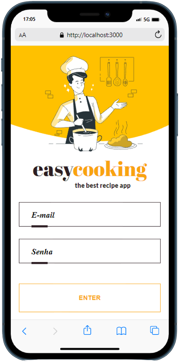

# Welcome to the EasyCooking project repository!

## Description

Project developed by [Júlia Domenciano](https://github.com/juliadomenciano), [Severo](https://github.com/severidade), [Alisson Dahlem](https://github.com/AlissonDahlem), [Pedro Tristão](https://github.com/Pedroptristao), [Raphael Fiorda](https://github.com/raphaelfiorda) during the Trybe software development course.

A recipe app was developed, using the most modern within the React ecosystem: Hooks and Context API.

It is possible to see, search, filter, favorite and follow the progress of preparation of recipes and drinks.

The database consists of two distinct APIs, one for food and one for drinks.

The layout focuses on mobile devices, so the prototype was developed for smaller screens.

## Tools

  * React.js;
  * RTL (React Testing Library);
  * CSS3.

## Skills Developed

  * Use the _React_ Context API to manage state;
  * Using the _React Hook useState_;
  * Using the _React Hook useContext_;
  * Using the _React Hook useEffect_.
  * Create custom Hooks

# Imagens

  
  
  
  
  
  
  
  
  
---------

# Boas vindas ao repositório do projeto EasyCooking!

## Descrição

Projeto desenvolvido por [Júlia Domenciano](https://github.com/juliadomenciano), [Severo](https://github.com/severidade), [Alisson Dahlem](https://github.com/AlissonDahlem), [Pedro Tristão](https://github.com/Pedroptristao), [Raphael Fiorda](https://github.com/raphaelfiorda) durante o curso de desenvolvimento de software da Trybe.

Foi desenvolvido um app de receitas, utilizando o que há de mais moderno dentro do ecossistema React: Hooks e Context API.

Nele é possível ver, buscar, filtrar, favoritar e acompanhar o progresso de preparação de receitas e drinks.

A base de dados são de duas APIs distintas, uma para comidas e outra para bebidas.

O layout tem como foco dispositivos móveis, então o protótipo foi desenvolvido para telas menores.

## Ferramentas

  * React.js;
  * RTL (React Testing Library);
  * CSS3.

## Habilidades Desenvolvidas

  * Utilizar a Context API do _React_ para gerenciar estado;
  * Utilizar o _React Hook useState_;
  * Utilizar o _React Hook useContext_;
  * Utilizar o _React Hook useEffect_;
  * Criar Hooks customizados.
